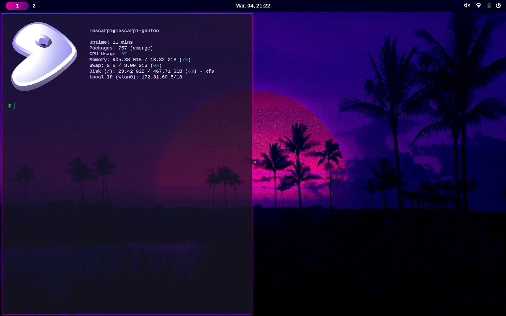

This repository contains configuration files used for Linux desktop customization.

## What are dotfiles? ##
In Linux, many applications store their configuration in files that start with a dot '.', like '.bashrc'.

We can use these files to customize the behavior and appearance of terminals, editors, desktop environments and others.

By saving these personal configuration files in a repository, it is possible to easily reapply the customization on another computer or after changing your Linux distro, for example.

## Tools ##
- **Bash** – Shell used.
- **Fastfetch** – Displays system information in the terminal.
- **Fuzzel** – Minimal launcher for running applications.
- **Greetd** – Lightweight login/session manager.
- **Kitty** - Terminal emulator.
- **Niri** – Scrollable tiling window manager.
- **Neovim** – Text editor.
- **Waybar** – The status bar.
- **GNU Stow** - Used to create the symlinks.

## Installation / Usage ##
I created this repo as a personal experiment in customizing my system. It was not intended to work in every environment, and the setup script is not robust. Therefore, it will likely not work out-of-the-box and require some tweaking.

It requires the tools listed above and any Nerd Font for the Waybar icons.

By running
```sh
sudo ./symlinks
```
in the dotfiles folder, Stow will create the symlinks in each tool configuration path, and if everything runs ok it should work after restarting the tools.

## Desktop Preview ##

